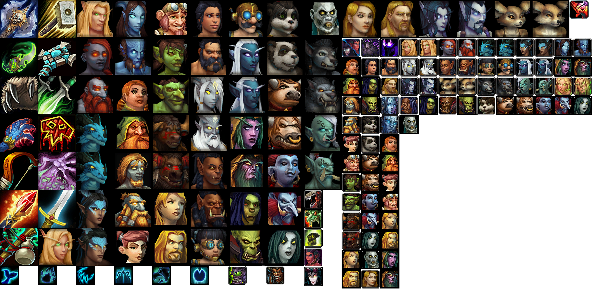

# Forever Classic Characters

Classic-style race portraits for **World of Warcraft: Forever**. Replaces the eight original races' male and female character-creation portraits with edited Classic artwork. Horde portraits are mirrored to face inward in the character-creation screen.

**[Download the texture pack](https://github.com/Aganmar/ForeverClassicCharacters/releases/latest/download/ForeverClassicCharacters.zip)**

Tested in-game on Windows with Forever beta **1.60.1.70009**. **_This is a texture pack, not a Lua addon._**

## Install

1. **Fully close WoW Forever.**
2. Download **ForeverClassicCharacters.zip** using the link above, then extract it.
3. Open your World of Warcraft installation and enter **`_classic_beta_`**.
4. Copy the extracted **`Interface`** folder into `_classic_beta_`, merging it with the existing Interface folder.
5. Launch Forever and open **Create Character**.

The installed file should be at:

```text
World of Warcraft/
└── _classic_beta_/
    └── Interface/
        └── Glues/
            └── CharacterCreate/
                └── CharacterCreateIcons.blp
```

The usual Windows location is `C:\Program Files (x86)\World of Warcraft\_classic_beta_`.

**Do not put the pack in `Interface/AddOns`.** It will not appear in the AddOns list. A full game restart is required; `/reload` is insufficient.

If `CharacterCreateIcons.blp` already exists at this location, back it up first. This pack replaces that one texture and cannot be combined automatically with another pack that replaces the same file.

## Uninstall or update

- **Uninstall:** close the game and delete only `Interface/Glues/CharacterCreate/CharacterCreateIcons.blp` from `_classic_beta_`. The game will use its built-in artwork again. If you previously used another replacement, restore your backup instead.
- **Update:** close the game, extract the latest download, and copy its Interface folder into `_classic_beta_`, replacing this pack's existing BLP file.

**Never delete your entire Interface folder.**

## If nothing changes

Check the folder path above and restart the game completely. Confirm that you launched **Forever beta**, not Classic Era or another client. Other UI elements using the same texture may also display the replacement portraits.

Future beta updates may change the texture layout. If portraits look incorrect after an update, uninstall this pack and check for a new release. Other builds and clients have not been tested.

## Editable artwork

The PNG source is [artwork/CharacterCreateIcons.png](artwork/CharacterCreateIcons.png). It can be opened in Aseprite. Preserve the **2048 × 1024** canvas, atlas positions, and transparency. The game uses the BLP file; editing the PNG alone does not update the installed texture.



## Credits and rights

Original World of Warcraft artwork: **Blizzard Entertainment**. Portrait editing and pack assembly: **Aganmar**, using waifu2x, Aseprite, and Codex-assisted tooling.

This is an unofficial fan project, not affiliated with or endorsed by Blizzard Entertainment. It includes Blizzard-owned artwork and is **not offered under a blanket open-source or Creative Commons license**. See [COPYRIGHT.md](COPYRIGHT.md). Free availability and attribution do not themselves grant permission to redistribute Blizzard artwork.
